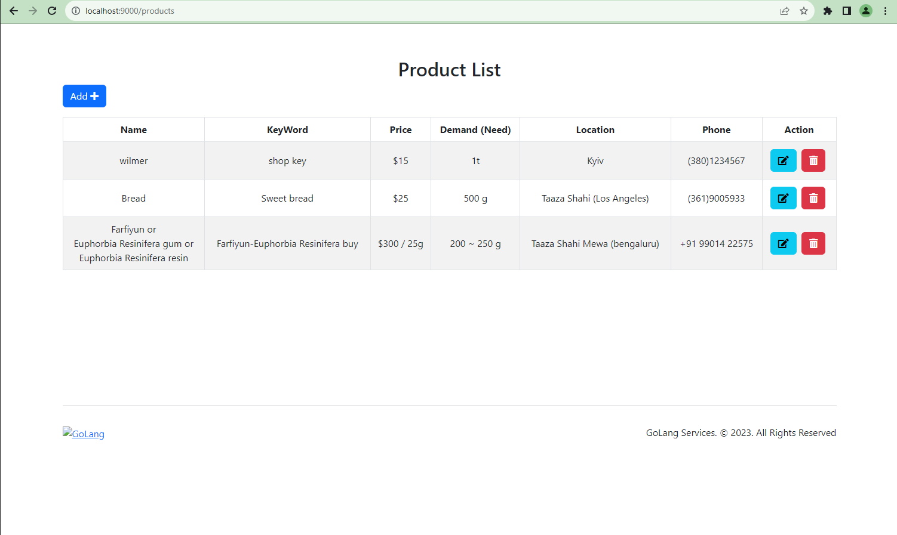

# go-test

## How to run

go run .\main.go

localhost:9000/products

Please run this app and check 3rd row.

You can click 'ADD Button' to check url.

  
  
Your favorite React-Django boilerplate.

